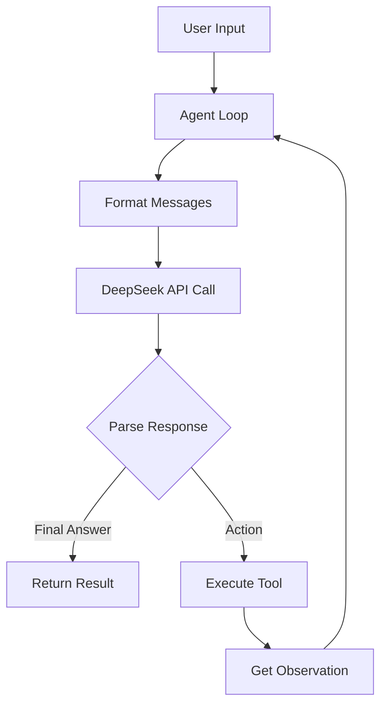

# DeepSeek API Agent Conversion Plan

## Current Architecture Analysis

The existing [`agent_demo.py`](agent_demo.py:1) implements a ReAct (Reasoning + Acting) framework with:
- Tool registration system ([`AVAILABLE_TOOLS`](agent_demo.py:10))
- Mock LLM function ([`call_llm`](agent_demo.py:16)) with hardcoded responses
- Agent loop with Thought/Action/Observation pattern ([`run_agent_loop`](agent_demo.py:37))

## Conversion Strategy

### 1. API Integration Design
- Replace mock [`call_llm`](agent_demo.py:16) with real DeepSeek API calls
- Use official DeepSeek API endpoint: `https://api.deepseek.com/v1/chat/completions`
- Maintain existing message format compatibility

### 2. Configuration Management
```python
# New configuration structure
DEEPSEEK_CONFIG = {
    "api_key": os.getenv("DEEPSEEK_API_KEY"),
    "base_url": "https://api.deepseek.com/v1",
    "model": "deepseek-chat",
    "temperature": 0.1,
    "max_tokens": 2000
}
```

### 3. Enhanced Message Flow


### 4. Key Changes Required

#### File Structure Updates:
- [`agent_demo.py`](agent_demo.py:1) - Main agent implementation
- `.env` - API key configuration (new)
- `requirements.txt` - Dependencies (new)

#### Code Modifications:
1. **Replace [`call_llm`](agent_demo.py:16)** with real API implementation
2. **Add error handling** for network issues and API limits
3. **Enhance response parsing** to handle DeepSeek's output format
4. **Maintain existing tool system** without changes

## Implementation Steps

1. **Environment Setup** - Create configuration files
2. **API Integration** - Implement real DeepSeek API calls  
3. **Message Formatting** - Adapt to DeepSeek API requirements
4. **Error Handling** - Add robust error management
5. **Testing** - Validate with example queries
6. **Documentation** - Update usage instructions

## Expected Outcome

The converted agent will:
- Use real DeepSeek API for reasoning instead of mock responses
- Maintain the same ReAct framework and tool execution
- Handle API errors gracefully with retry logic
- Be production-ready with proper configuration management

## Dependencies Required
- `python-dotenv` for environment variables
- `requests` for API calls (or `openai` package if compatible)